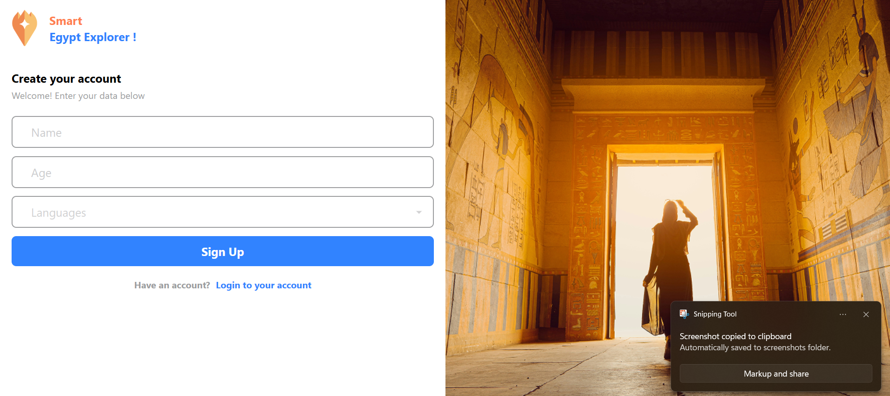
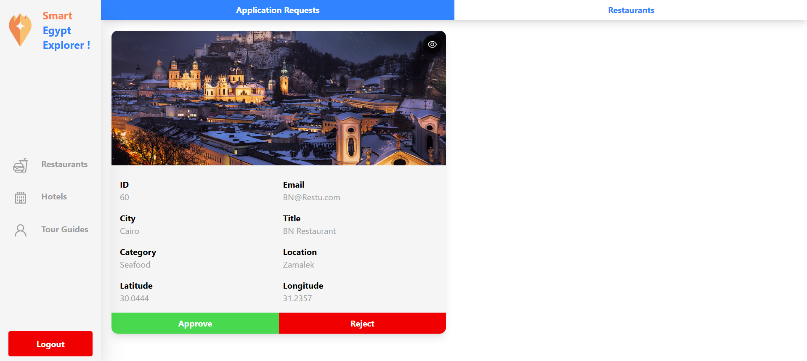
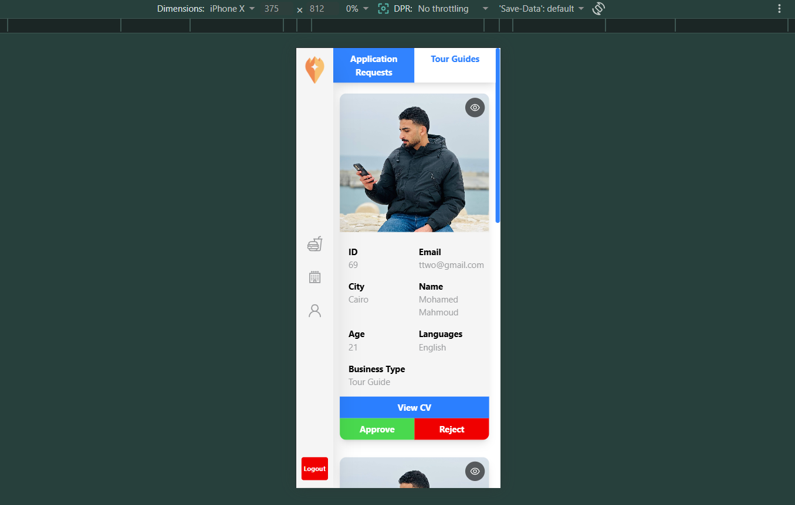

# 🇪🇬 Smart Egypt Explorer - Management Dashboard

A professional, multi-role management system designed to streamline the Egyptian tourism industry. This dashboard serves as a bridge between service providers (Restaurants, Hotels, Tour Guides) and administrative moderators.

---

## 🖼️ System Preview (Screenshots)

### 🔐 Authentication Flow
| Login Screen | Registration - Basic Info | Registration - Documents |
| :---: | :---: | :---: |
|  |  |  |

### 🛠️ Administrative & Management
| Admin Request Review | Password Recovery (OTP) | Mobile Responsiveness |
| :---: | :---: | :---: |
|  |  |  |

---

## 🚀 Key Features

### 1. Administrator Dashboard
*   **Request Moderation:** Review, Approve, or Reject incoming requests from local businesses.
*   **Live Content Control:** Hide or delete active listings to ensure quality and compliance.
*   **Document Viewer:** In-app modal previews for commercial licenses and Tour Guide CVs.

### 2. Business Owner Dashboard
*   **Dynamic Service Catalog:** Full CRUD (Create, Read, Update, Delete) functionality for managing services.
*   **Profile Management:** Update business hours, location coordinates, and descriptions.
*   **Verification Tracking:** Real-time status updates on the administrative approval process.

### 3. User Experience
*   **Clean UI/UX:** Built with a professional, minimalist aesthetic for ease of use.
*   **Responsive Design:** Fully optimized for desktops, tablets, and smartphones.
*   **Secure Auth:** Robust login/signup flow with persistent sessions and email-based password recovery.

---

## 🛠️ Tech Stack

*   **Frontend:** [React.js](https://reactjs.org/) (Vite)
*   **Styling:** [Tailwind CSS](https://tailwindcss.com/)
*   **Routing:** [React Router DOM](https://reactrouter.com/)
*   **Icons:** [React Icons](https://react-icons.github.io/react-icons/)
*   **State Management:** React Context API

---

## 📂 Project Structure

```bash
src/
├── api/                  # API endpoints and Axios configurations
├── assets/               
│   ├── icons/            # Branding and UI icons
│   ├── images/           # Backgrounds and hero images
│   └── screenshots/      # Documentation visuals
├── components/
│   ├── layouts/          # Reusable page wrappers (Admin/Login layouts)
│   └── UI/               # Atomic components (Buttons, Modals, Sidebar)
├── context/              # Authentication and Global State
└── pages/                # Functional page components
